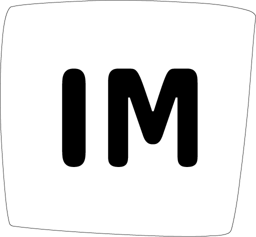

# My website

  
  
  
  

  

Hello there! Here is the source code of my website, that you can see [clicking here](https://www.italomlp.com). It was made with  [GatsbyJS]() and  [ReactJS](), without an initial template. This means that all designs and structures were made by me. It's not perfect, but I tried to look for inspirations in Dribble and Pinterest and hits that. The colors were taken by my name ones, from the [Synthesis - WHAT COLOR IS YOUR NAME?](https://synesthesia.me/see-your-name) web app.

Most technologies that I used:
- GatsbyJS
- ReactJS
- Styled Components
- Typescript
- React Reveal
- Behaviour Scrolling (with vanilla JS)
- React Intl (with gatsby-plugin-intl)
- React Rainbow Timeline Component (just that, without whole library - thanks to [Bit](https://bit.dev/))
- and much more.